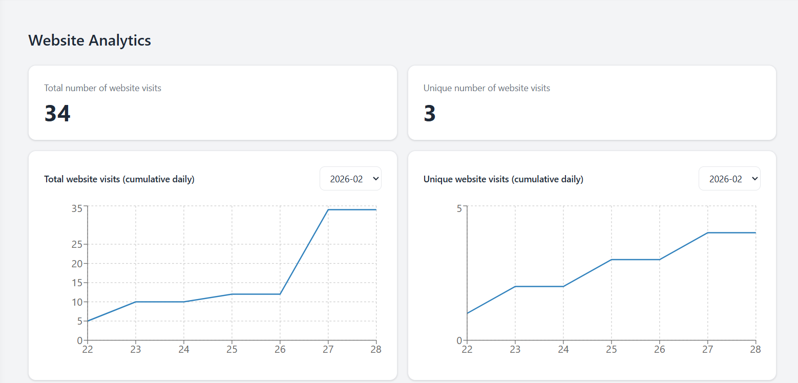
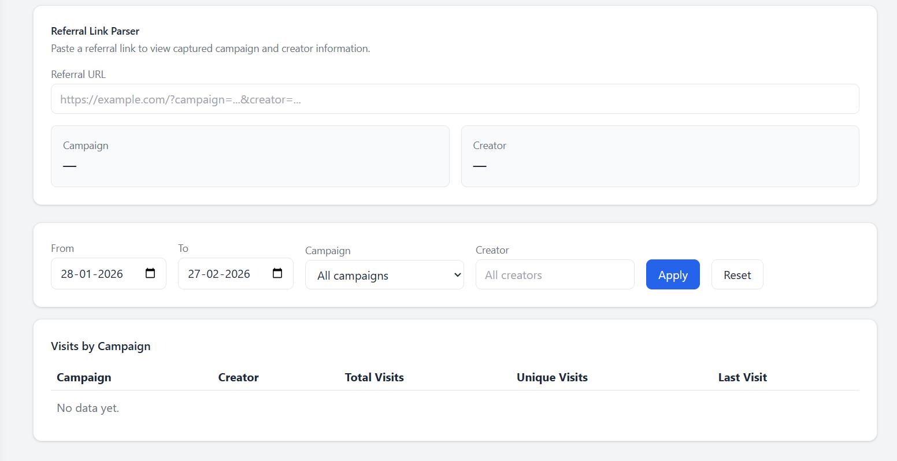
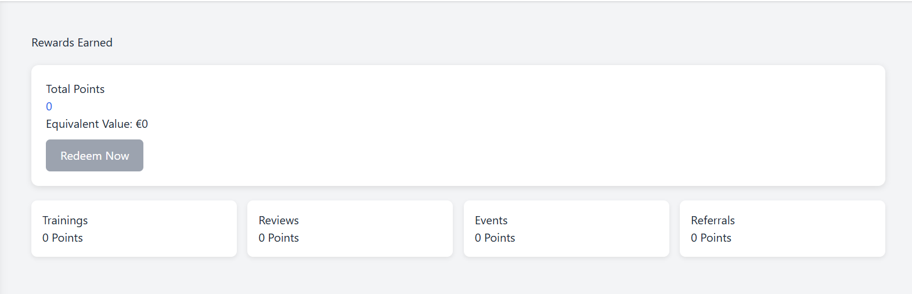
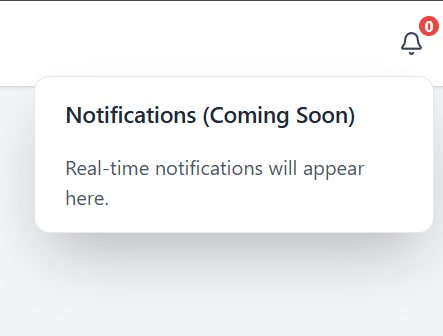

# Creator Analytics Dashboard

A web-based analytics dashboard developed as part of the **Applied IT Project** at Mediadesign Hochschule Berlin.  
The system allows student content creators and marketing managers to monitor website traffic, campaign performance, and rewards earned through activities.

---

## Project Overview

This project implements a dashboard that provides insights into website analytics and creator performance.  
The platform allows users to view website visit statistics, analyze traffic trends, track campaign attribution using referral links, and monitor reward points earned through different activities.

The system was developed in a Scrum team using Agile methodology and GitHub for version control and collaboration.

---

## Key Features

### Website Analytics
- Displays **total website visits** and **unique website visits**
- Visualizes **traffic trends using cumulative charts**
- Allows filtering by **date range and campaign**

### Referral Link Parser
- Extracts **campaign** and **creator information** from referral URLs
- Helps marketing managers track campaign attribution

### Rewards Dashboard
- Displays **total reward points earned**
- Shows activity-based rewards including:
  - Trainings
  - Reviews
  - Events
  - Referrals
- Includes a placeholder for future **reward redemption functionality**

### Notifications
- Notification placeholder in the navigation bar
- Designed to support **future real-time notifications**

---

## Screenshots

### Website Analytics Dashboard
Shows total website visits, unique visits, and cumulative traffic trends.

---

### Referral Link Parser
Allows users to paste referral links and extract campaign and creator information.

---

### Rewards Dashboard
Displays creator reward points earned from different activities.

---

### Notification Placeholder
Notification component prepared for future real-time alerts.

---

## My Contributions

My primary focus in this project was **frontend development**.  
My contributions include:

- Implemented **notification placeholder in the navigation bar**
- Designed and built the **rewards dashboard UI**
- Developed the **website analytics dashboard**
- Implemented **cumulative charts for visit analytics**
- Created the **referral link parser interface**
- Coordinated with backend developers for API integration

---

## Technologies Used

- GitHub
- Agile Scrum methodology
- Frontend web development
- REST APIs
- VS Code

---

## Development Process

The project was developed using **Scrum methodology** in a team of 26 members.

The development process included:
- Sprint planning
- Daily stand-ups
- Sprint reviews
- Git branching and pull requests
- Iterative feature development

---

## Project Report

The complete project documentation is included in this repository.

You can read the full report here:

📄 **Applied IT Project Report**

---

## Future Improvements

Possible future improvements include:

- Authentication and role-based access control
- Real-time notifications
- Reward redemption workflow
- Advanced campaign analytics
